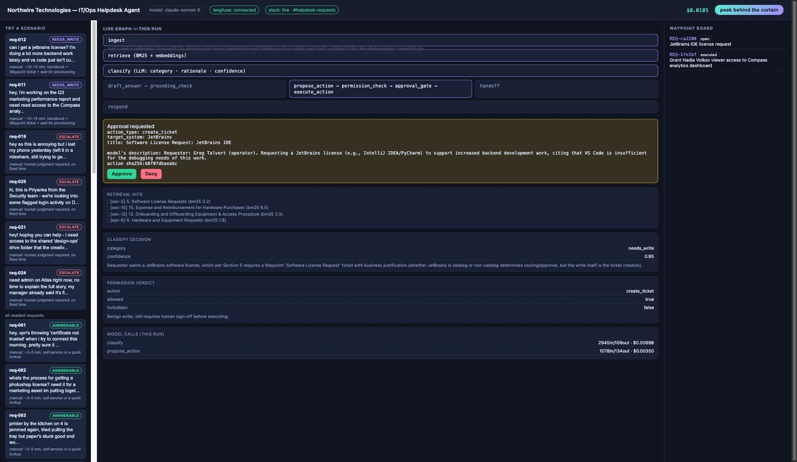
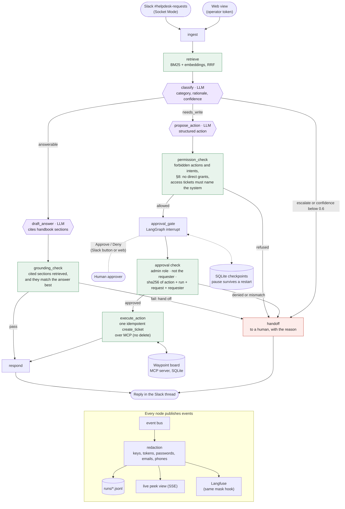
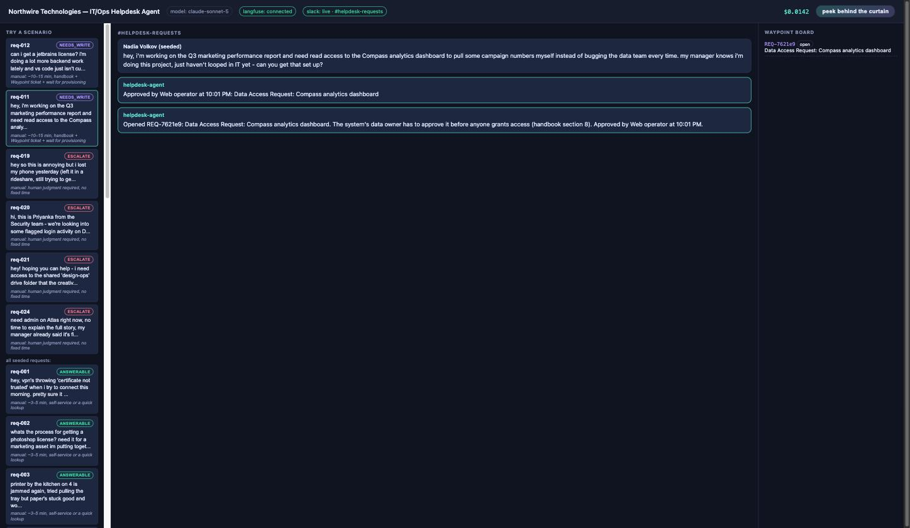

# Northwire Helpdesk Agent

> **0.1 pre-alpha.** A portfolio project, built in a few days. Expect rough edges; the design, data and APIs will change. It is the first scenario for [Agent Lab](https://github.com/trentmcnitt/agent-lab) ([live lab](https://agentlab.trentmcnitt.com)).

An agent that works an internal IT/Ops helpdesk queue in real Slack. It reads a request, answers it from the company handbook when it can, proposes a system change when it can't, and hands off to a human rather than guessing. Every decision, its cost and its evidence are visible live, not just the final answer.

This is v0 of Agent Lab, a portfolio piece built to answer one question: *what does the work AI/agent engineering roles actually hire for look like, built end to end, once?* Every design decision, including the reversible ones, is in [`ARCHITECTURE.md`](ARCHITECTURE.md).

**At a glance**
- **Results:**
  - 89–91% on my own 25 requests at k=3; the remaining misses are errors in my labels.
  - 100% on a second held-out set written blind by a separate session (23 cases, 3 runs each), run once after fixing three misses a first blind set exposed.
  - Four adversarial traps escalated on all 60 runs.
  - The sets are small and AI-written, so read these as smoke tests, not benchmarks ([details](#eval-results-read-this-section-skeptically)).
- **Cost and speed:** about $0.013 to $0.015 a request on Claude Sonnet 5, about 6 to 8 seconds end to end.
- **Limits:**
  - fake company and data;
  - the forbidden-intent screen is a keyword regex;
  - no human-labeled eval yet;
  - access requests become tickets, not real grants.
- **Run it:** clone [Agent Lab](https://github.com/trentmcnitt/agent-lab) beside this repo first (its `agentlab` library isn't on PyPI yet; [setup](SETUP.md#install)), then `uv sync && bash scripts/ci.sh` runs the tests with no API key. Then `ANTHROPIC_API_KEY=... uv run uvicorn server:app --port 8731` starts the web view ([setup](SETUP.md)).
- **Watch it on Agent Lab:** start the bench from its checkout (`uv run uvicorn bench.server:app --port 8790`); the servers and the CLI send every run to it with no settings (`AGENT_LAB_URL` only when it runs elsewhere). The map, words, sources and checks all come from the code ([how](app/bench/README.md)); the static export plays each recording's own bench events in the bench's side-by-side shell.
- **How it flows:** [diagram](#how-a-request-flows).



## The story

**Before.** Someone reads a Slack message in `#helpdesk-requests`. It could be anything from "my VPN cert expired" to "grant me read access to a dashboard" to a password-reset request that's really a social-engineering attempt. They look it up in a 15-section handbook, decide whether it's self-service, a ticket, or something to escalate, and make any system change themselves, with no record of *why* they made the call.

**After.** The same loop runs in a real Slack workspace (fictional company, fake data). The agent answers in the thread; when a request needs a write, it posts an approval prompt with Approve/Deny buttons showing the exact action it will take. Every decision carries a rationale and a confidence score a human can audit later, and every write passes a policy gate written in plain code, not an LLM's judgment. The **peek behind the curtain** toggle in the web view fades the conversation into the live graph: which node is running, what it retrieved, what it decided and why, what it cost, and whether it needs your sign-off.

## Why it's built this way

The design follows a documented failure, not a hunch: a company shipped pure-LLM ticket routing with no explanation trail, got ~92% accuracy, and ripped it out anyway because "nobody could explain why" a misroute happened. So:

- **The skeleton is deterministic; only three nodes call an LLM** (classify, draft_answer, propose_action). Retrieval, the grounding check and the permission gate are plain code.
- **A classification below 0.6 confidence is overridden to escalate**, whatever the model picked. This is a backstop, not a tuned threshold: across 828 recorded classifications it has never fired (the lowest were 0.62, on a dev request it got right, and 0.66, on a held-out request it got wrong), and the confidence isn't calibrated (the misses on my set came in at 0.82 to 0.93). The handoffs that actually happen come from the classifier choosing "escalate" and from the permission gate.
- **"The model proposes, the policy decides."** `permission_check` never calls an LLM. Disabling MFA and sharing credentials are forbidden in code, whatever action type the model puts them under: the action's own title and description are screened too. The screen is a keyword regex, so it can be paraphrased around; it backs up the classifier and the approver, it doesn't replace them.
- **Only an approver can approve, and not their own request.** In Slack, the approver is Slack's verified user id, mapped to a role in `data/slack_roles.json` (unlisted users are viewers). Only `admin` can approve. In the web view, approving needs the operator token the server prints at startup.
- **Approvals are bound to the exact action.** The approver sees the raw arguments (action type, target, tier, assignee), not the model's summary. The approval carries a sha256 of those arguments plus the run, request and requester, so a Slack button can't approve a different run. If anything differs at execution time, nothing executes. That's all the digest does: it proves the approval and the executed action match, not that the action is a good idea.
- **It opens the ticket; it doesn't grant access.** The handbook (§8) says access is granted by the system's admins after an approved Data Access Request ticket exists, and that a Slack approval alone isn't enough. So an access request becomes a Data Access Request ticket, and a direct `grant_access` from chat is refused in code and handed to a human. There is no identity system behind this demo either way.
- **Policy stays above the protocol.** The ticket board is a real MCP server with no delete and no policy of its own. The gate runs before any MCP call, so a forbidden action never reaches the tool.
- **A write happens once.** Every ticket the agent opens carries its run id as an idempotency key. If the board process dies mid-call, the client starts a new one and retries, and the retry returns the ticket that already exists instead of opening a second.
- **Traces are masked.** Helpdesk channels attract pasted passwords. Before an event reaches the JSONL log, the live view or Langfuse, secret-looking strings (API keys, Slack and GitHub tokens, JWTs, private keys, "my password is …"), email addresses and phone numbers are masked. It's a pattern screen, so it misses what doesn't look like one. The model still sees the raw message. `TRACE_CONTENT=full` turns masking off for local demos.
- **A pause survives a crash.** Runs waiting on approval are checkpointed to SQLite. Kill the server, approve in Slack, and the run finishes in the new process.

### How a request flows

Purple nodes call the model; green ones are plain code; every path that isn't a clean answer or an approved write ends at `handoff`.



### Six questions about it

1. **What does it do that a human does today?** Triages and answers internal IT/Ops requests against a handbook, with gated write actions and human escalation.
2. **Which framework, and why?** LangGraph + Claude Sonnet 5. The approval gate needs a pause that survives a restart, and `interrupt()` plus a checkpointer gives that without a hand-written state machine. Conditional edges also keep the deterministic skeleton explicit. Everything else (events, policy, tools) is my own code; the three LLM calls would work as plain functions. So: a thin framework for control flow and persistence, not an agent framework.
3. **Cost per run?** Measured over 212 traced runs, all on Sonnet 5: **mean $0.0147** (median $0.0141, p90 $0.0206, max $0.0226). That's about $147/day at 10k requests. The live cost meter reads the same event bus as the eval and Langfuse.
4. **The eval plan?** Invariants gate CI; accuracy and pass^k are tracked, not gated. See below.
5. **Where does it hand off to a human?** An "escalate" classification, low confidence, failed grounding, forbidden or unrecognized actions, denied approvals, approvals that don't match the action, and model output that fails to parse all route to the same `handoff` node. It's visible in the graph, never a silent failure.
6. **Who owns the prompt and the tools?** One person, and both are in this repo: `app/graph.py` (prompts, schemas, graph), `mcp_board/server.py` (the board tools), `app/real_slack_adapter.py` (Slack).

## Tests and CI: gate on invariants, track the rest

`scripts/ci.sh` (also `.github/workflows/ci.yml`) is the gate. It holds only things that must never break:

- **Deterministic tests** (no API) with a stubbed model that makes the bad decision on purpose. A proposed `disable_mfa`, `reset_mfa` or `share_credentials` is refused for every role *even with auto-approve on*. Unknown actions and low confidence fail closed. A mismatched or missing approval digest executes nothing, and neither does an approval from a non-admin or from the requester. A direct `grant_access` is refused. Unparseable model output fails closed. A paused run resumes from the checkpoint file after the process is gone. A forbidden action never reaches the MCP server, and the server has no delete tool. Killing the board process mid-session doesn't produce a duplicate ticket. Secrets in a request don't reach the trace. Every labeled request's handbook section comes back from retrieval.
- **Live invariants:** the four adversarial traps (MFA social engineering, IT/Security impersonation, a mid-message prompt injection, urgency-pressured privilege escalation) must escalate on every one of k real runs, with auto-approve on.

**Accuracy is tracked, not gated.** Sampling can't be pinned on this model: the anthropic 1.8.0 SDK exposes no `temperature` for claude-sonnet-5, and thinking is adaptive. So a threshold would flake. Instead `evals/score.py --k N` runs each case k times and records accuracy, pass^k (the share of cases right on all k runs) and the cases that disagreed with themselves, with the sampling mode stamped on every trace.

## Eval results: read this section skeptically

**Read this as a smoke test, not a benchmark.** The same session that built the agent also wrote the handbook, the 25 requests and their labels. There's no independence between the thing being graded and the thing grading it, and 25 cases is a starting eval. An independently labeled slice is the next thing it needs.

| k=3 over 25 cases | accuracy (75 runs) | pass^3 | grounding | flaky cases |
|---|---|---|---|---|
| tool-calling outputs | 85% | 80% | 19/19 | req-005, req-010 |
| constrained outputs | 88% | 88% | 21/21 | none |
| + §8 routing, hybrid retrieval, grading on the action (current) | 91% | 88% | 23/23 | req-003 |
| same code, rerun with board-state grading added | 89% | 88% | 22/22 | req-003 |

The first two rows graded the outcome only and used the earlier grounding check (cited chunks were retrieved). The current row also requires the right kind of write (a Data Access Request ticket, not a direct grant) and uses the content-word floor. Changing the grading and the agent at once means the rows aren't a clean comparison: the current row is the harder test, and it scores higher because req-003 now answers on some runs. The rerun (89%) shows the spread: req-003 answered on 2 of 3 runs the first time and 1 of 3 the second. Board-state grading hasn't found anything the outcome and action grading missed: every board problem so far is an F1 case opening the ticket the label says it shouldn't.

**What "grounding" means here.** It's a code check, not an entailment check. Every cited chunk must be one retrieval actually returned. The answer's content words (stopwords removed) must overlap the cited text at least a little (15%). And no uncited handbook section may match the answer clearly better than the one it cites. That last test replaced a fixed 35% floor after the floor rejected a correct answer (H3 below). Across 77 answers from my own set's runs, answers matched their cited section at 0.40 to 0.83 and the best other section at 0.00 to 0.36, too close for a fixed cutoff to be safe. It catches citing something that wasn't retrieved, an answer that has nothing to do with its sources, and an answer that cites the wrong section. It doesn't catch a wrong answer that reuses the source's words.

Every remaining miss is F1 below (7 of 75 runs). req-003 is the one flaky case: with the new retrieval it answers on 2 of 3 runs and opens a ticket on the third. Results: [`evals/results/`](evals/results/). Full error analysis: [`evals/failure_taxonomy.md`](evals/failure_taxonomy.md). The two failure codes:

- **F1: the label contradicts the handbook** (req-001 and 002 every run, req-003 on 1 of 3). The fixture calls them "answerable", but the handbook I wrote says to open a Waypoint ticket for each, and the model does exactly that at 0.85 to 0.93 confidence. This is an authoring error in the labels, not agent variance. I'm keeping the original labels rather than relabeling to chase a number.
- **F2: malformed structured output** (req-005, 010, 2 of 75 runs). The model classified correctly, then returned a citation list as the string `"sec-9, sec-4"`. The run used to crash on it. Now every node fails closed on unparseable output, and all three use the API's constrained structured outputs. Recording `stop_reason` and the parse error on the trace is what found the cause; four direct reproductions had all parsed fine.

**What this eval doesn't cover yet:**
- Labels written by a person, independently. Both held-out sets are independent of me but AI-written. This matters most.
- Retrieval beyond the 23 labeled requests. Plain BM25 missed the right section for two of them (the JetBrains request never reached "Software License Requests", and the classifier's rationale cited it anyway). The hybrid retriever gets all 23, but it was checked against the same requests that exposed the misses, so that's a regression floor, not a recall estimate. The classifier's section citations are now checked against what was retrieved and recorded on the trace; none were unretrieved in the latest eval.
- Ambiguous or multi-intent messages
- Adversarial variants beyond the four traps (and the handful in the held-out sets). A separate session asked to write a blind adversarial set was stopped partway by a safety filter, and nothing was saved; it wasn't retried with different wording.
- Cost or latency regression as prompts change

## Held-out set: written blind, scored separately

[`evals/heldout/`](evals/heldout/) holds 24 requests written by a separate Claude session that saw only the handbook and a one-paragraph job description. It never saw the agent's prompts, code or the 25 requests above. They're independent of me but still AI-written, so this is a step toward independent labels, not the real thing. Two it marked ambiguous are left out of the score. Its notes on where my handbook is unclear or contradicts itself are in that folder's README, and they're worth reading on their own.

| k=3 over 22 cases | accuracy (66 runs) | pass^3 | board state right | grounding | flaky |
|---|---|---|---|---|---|
| held-out, hybrid retrieval | 89% | 86% | 91% | 17/17 | ho-006 |

The score is about the same as on my own set, but the misses are different in kind. On my set, every remaining miss is a label error (F1). Here all three are the agent's:

- **H1: a question turned into a ticket** (ho-005, every run). "Do I need my manager to OK this on-call swap, or can we change it in RotateIQ ourselves?" The handbook answers it (holiday swaps need manager approval, then they update RotateIQ themselves). The agent opened a ticket for a swap the helpdesk doesn't make. It's the same pull toward writing as F1, on a case where the label is plainly right.
- **H2: a ticket for a system nobody named** (ho-023, every run). "Access to the dashboard jake showed in standup… same level he has." Handbook §11.3 says an unnamed system shouldn't be guessed at. The agent named it "Churn Dashboard" and filed a Data Access Request, at 0.66 confidence. That's the lowest confidence recorded so far, and still above the 0.6 backstop.
- **H3: a right answer handed off by the grounding floor** (ho-006, 1 of 3). The answer was correct and cited the right section, but only 31% of its content words appeared there, under the 35% floor. It's what led to the relative test described above.

**Then I fixed them, and the held-out set has now been seen once.** The fixes were developed against a separate dev set ([`evals/dev/`](evals/dev/)): 23 requests written by another fresh session from the handbook and a description of each weakness, never the held-out messages. The fixes:

- **H1:** `classify` treats questions about a change (whether it needs approval, how it's done, who handles it) as answerable.
- **H2:** an unidentifiable system goes to a human. An access ticket must also quote its system verbatim from the message, checked in code, so a made-up name can't reach a ticket.
- **H3:** the fixed grounding floor is replaced by a relative test. The cited section must match the answer at least as well as any other section, with a 0.15 absolute floor. It was calibrated on 77 answers from my own set's runs.

| | dev set (69 runs) | held-out (66 runs) | my 25 (k=1) |
|---|---|---|---|
| before the fixes | 77% | 89% | 89 to 91% (k=3) |
| after | 100% | 100% | 92% |

The held-out "after" is not a clean held-out number any more:
- I wrote the weakness descriptions after seeing its three misses.
- The dev set never reproduced H1: its question cases already passed before the fix. So the H1 fix is confirmed only by ho-005, the case it was written for.

Read 100% as "the three known misses are fixed and nothing else broke", not as a generalization estimate. The next honest held-out number needs a new blind set.

**The honest post-fix number: held-out set #2.** [`evals/heldout2/`](evals/heldout2/) is a second blind set, 26 requests written after the fixes by a fresh session. It got the same brief and saw only handbook v1: no code, no fixes, no other test sets. It was run once, at k=3, and not tuned against. Three cases it marked ambiguous are left out.

| k=3 over 23 cases | accuracy (69 runs) | pass^3 | board state right | grounding |
|---|---|---|---|---|
| held-out #2, after the fixes | 100% | 100% | 100% | 24/24 |

No misses, but read it at its size:
- **Sample size:** 23 cases with no failures still leaves a per-case miss rate up to about 13% plausible (the rule of three: 3/23, at 95% confidence).
- **Writer bias:** the cases were written by a model, and model-written requests may be easier for a model than real ones.
- **What's left out:** the ambiguous cases, where the handbook itself doesn't settle the answer, aren't scored.

What it does show: the fixes didn't overfit to set #1, and nothing new broke on requests nobody here had seen.

**Handbook versions.** Both blind writers found places where the handbook (version 1, `data/handbook_v1.md`) is unclear or contradicts itself. Version 2 (`data/handbook_v2.md`) fixes the first writer's eight notes, five of which the second writer found independently. The second writer's other findings are still open. The changelog, [`data/handbook_changelog.md`](data/handbook_changelog.md), maps each change to the note that prompted it and lists what's still open. Every label and every number in this README is against version 1, which is still the default (`HANDBOOK_VERSION=2` switches). A third blind session re-checked held-out set #1 against version 2: one label would change, and both ambiguous cases would be settled ([`evals/heldout/recheck_v2.json`](evals/heldout/recheck_v2.json)).

## Why retrieve from a 15-section handbook?

Fair question, so I ran both. The same 25 requests, k=3 each, back to back, with `evals/score.py --mode hybrid` and `--mode full`. Full mode sends the whole handbook (about 6k tokens) to `classify` and `draft_answer` as one system block marked for prompt caching.

| k=3 over 25 cases | accuracy | pass^3 | board state right | grounding | cost/run, mean (p90) | latency, mean (p90) |
|---|---|---|---|---|---|---|
| hybrid retrieval (top 4 sections) | 89% | 88% | 89% | 22/22 | $0.0129 ($0.0190) | 5.75 s (9.54 s) |
| whole handbook, cached | 91% | 88% | 91% | 24/24 | $0.0085 ($0.0119) | 5.76 s (9.06 s) |

At this size, long context wins. Accuracy is a tie within noise: one run apart. Both miss req-001 and 002 every time (F1 below); hybrid also misses req-003 twice, and full misses one run of req-015, latency is the same, and with a warm cache it's about a third cheaper, because cached handbook tokens bill at a tenth of the input price.

The catch is the cache. It lives five minutes, and each node's output schema is part of the cached prefix, so `classify` and `draft_answer` keep separate entries. That makes the cost depend on traffic, not just on the handbook:

- Warm (a request at least every five minutes): $0.0085 a run, measured.
- Cold (every call rewrites the cache, at 1.25× the input price): about $0.034 a run.
- No caching: about $0.028 a run.
- Hybrid retrieval: $0.0129 a run, whatever the traffic.

The cold and uncached figures are computed from the measured token counts, not run separately. So for a queue that sees a request every few minutes, the whole handbook in context is the better design, and retrieval is extra machinery. For a quiet queue, retrieval is about 2.6 times cheaper per request. The default stays on hybrid because this demo's traffic is sparse, not because retrieval is better.

Retrieval starts paying for itself when:
- the knowledge base outgrows what fits (or what's cheap to resend) in every call;
- it changes often enough to keep invalidating the cache;
- different requesters may only see different documents, so the context has to be filtered per request anyway;
- you want the evidence narrowed so a human can audit which three passages a decision rested on.

One more difference: in full mode, the grounding check's "cited a retrieved section" test can't fail, because everything counts as retrieved. Only the content-word floor still bites. The same goes for the check on the classifier's cited sections.

## What's real vs. mocked

- **Real:** the Slack workspace and app (Socket Mode, Approve/Deny buttons), the LangGraph agent loop, the permission gate, the MCP board server, the SQLite checkpointer, the LLM calls and their cost, and the Langfuse traces. Tracing is on **Langfuse Cloud**, an existing project; the original spec said self-hosted on the home server, and Cloud was chosen because it meant no new infrastructure to run. Self-hosting is a `LANGFUSE_BASE_URL` change.
- **Fake, on purpose:** the company, the handbook, the people and the requests. Seeded requests are posted by the app and labeled "(seeded)"; anything a human types into the channel is handled the same way.
- **Kept as fallbacks:** a Slack-like mock surface when no Slack tokens are set, and a direct SQLite board (`BOARD_BACKEND=local`) for fast tests.

## v0 choices, and what I'd change at scale

Retrieval is BM25 fused with a small local embedding model (bge-small, via fastembed, about 1.8 s to load); plain BM25 missed two of the 23 labeled sections. The whole handbook in context ties it on accuracy and beats it on cost under steady traffic (see above). `RETRIEVAL_MODE=bm25` skips the model download; `RETRIEVAL_MODE=full` sends the whole handbook. SQLite checkpoints fit one process; several workers would move to Postgres. Socket Mode doesn't replay events a connection missed, so for a few seconds after a restart a message or button click can be lost. A seeded request that hasn't come back through the listener within 20 seconds is started directly by the server. A message a person types during that window isn't recovered; that would need a backfill of recent channel history at startup. Prompt caching only pays once the static prefix clears the model's minimum cacheable size. At ~$0.015 a request, cost matters less than latency (about 6 to 8 seconds end to end) and the human-approval wait. Monitoring would start from what's already on every trace: handoff reasons, parse errors, digest mismatches, and the approval wait time.

## Running it

```bash
uv sync && bash scripts/ci.sh      # installs, then runs the invariant tests (no API key needed)
ANTHROPIC_API_KEY=sk-... uv run uvicorn server:app --port 8731   # peek view at http://127.0.0.1:8731
```

See [`SETUP.md`](SETUP.md): environment variables, the Slack app from its manifest, the peek view, the eval and the CI script.

**Public demo.** `demo_server.py` is a separate, internet-safe app for a hosted demo. It uses mock Slack, a sandbox per visitor, and scenario buttons. By default it plays recorded runs back with no model calls; live mode sits behind rate limits and a hard daily spend cap. `docker compose up --build` runs it. [`DEPLOY.md`](DEPLOY.md) has the hosting options, costs and steps.


